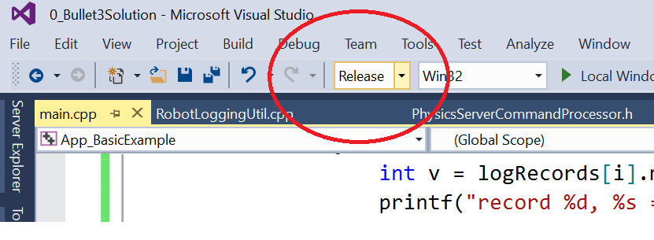

**************************
Build and install PyBullet
**************************

There are a few different ways to install PyBullet on Windows, Mac OSX and
Linux. We use Python 2.7 and Python 3.5.2, but expect most Python 2.x and
Python 3.x versions should work. The easiest to get PyBullet to work is
using pip or python setup.py.

Using Python pip
================

Make sure Python and pip is installed, and then run:

.. code-block:: bash

    pip install pybullet

You may need to use :code:`sudo pip install pybullet` or :code:`pip install pybullet --user`.
Note that if you used pip to install PyBullet, it is still beneficial to also
install the C++ Bullet Physics SDK: it includes data files, physics servers
and tools useful for PyBullet.

See also https://pypi.python.org/pypi/pybullet

Using setup.py
==============

You can also run 'python setup.py build' and 'python setup.py install' in the
root of the Bullet Physics SDK (get the SDK from
http://github.com/bulletphysics/bullet3).

Using premake for Windows
=========================

Alternatively you can install PyBullet from source code using premake
(Windows) or cmake. Make sure some Python version is installed in
c:\python-3.5.2 (or other version folder name).

First get the source code from github, using

.. code-block:: bash

    git clone https://github.com/bulletphysics/bullet3

Click on build_visual_studio_vr_pybullet_double.bat and open the
0_Bullet3Solution.sln project in Visual Studio, convert projects if needed.
Switch to Release mode, and compile the 'pybullet' project.

Then there are a few options to import pybullet in a Python interpreter:

1. Rename pybullet_vs2010.dll to pybullet.pyd and start the Python.exe
   interpreter using bullet/bin as the current working directory.
   Optionally for debugging: rename bullet/bin/pybullet_vs2010_debug.dll
   to pybullet_d.pyd and start python_d.exe)
2. Rename bullet/bin/pybullet_vs2010..dll to pybullet.pyd  and use command
   prompt: set PYTHONPATH=c:\develop\bullet3\bin (replace with actual folder
   where Bullet is located) or create this PYTHONPATH environment variable
   using Windows GUI
3. Create an administrator prompt (cmd.exe) and create a symbolic link as
   follows

.. code-block:: bash

    cd c:\python-3.5.2\dlls
    mklink pybullet.pyd c:\develop\bullet3\bin\pybullet_vs2010.dll

Then run python.exe and import pybullet should work.

Using cmake on Linux and Mac OSX
================================

Note that the recommended way is to use sudo pip install pybullet (or pip3).
Using cmake or premake or other build systems is only for developers who
know what they are doing, and is unsupported in general.

First get the source code from github, using

.. code-block:: bash

    git clone https://github.com/bulletphysics/bullet3

1. Download and install cmake
2. Run the shell script in the root of Bullet: build_cmake_pybullet_double.sh
3. Make sure Python finds our pybullet.so module:

.. code-block:: bash

    export PYTHONPATH = /your_path_to_bullet/build_cmake/examples/pybullet

That's it. Test pybullet by running a python interpreter and enter
'import pybullet' to see if the module loads. If so, you can play with the
pybullet scripts in Bullet/examples/pybullet.

Debugging of Bullet in VS Code
==============================

Debugging Bullet/PyBullet in VS Code is possible with the `gdb debugger <https://sourceware.org/gdb/>`_ and the `C/C++ extension <https://marketplace.visualstudio.com/items?itemName=ms-vscode.cpptools>`_ for VS Code.

Build Bullet for Debugging
--------------------------

It is necessary for debugging to build Bullet with debug symbols. To do this, change the build type flag of the :code:`cmake` call of :code:`build_cmake_pybullet_double.sh` to:

.. code:: bash
  
  ... -DCMAKE_BUILD_TYPE=Debug ... 
  
Also add

.. code:: bash

  if [ -e pybullet_d.so ]; then
    mv pybullet_d.so pybullet.so
  fi

to the end of the script right before the :code:`echo "Completed build of Bullet."` to rename the debug build with the :code:`_d` postfix. This way the Python interpreter can find the module.

Python Path
-----------

If the :code:`PYTHONPATH` was not set according to the `previous section <#using-cmake-on-linux-and-mac-osx>`_ for the used Python executable, :code:`PYTHONPATH` can be set through an :code:`.env` file in the VS Code workspace, which then must include the following line.

.. code:: bash

  PYTHONPATH=./build_cmake/examples/pybullet

Debug Configuration
-------------------

How to run files in VS Code is configured in :code:`launch.json` in the :code:`.vscode` folder of the workspace. Create the launch file and/or add the following configuration to it.

.. code::

  {
      // Use IntelliSense to learn about possible attributes.
      // Hover to view descriptions of existing attributes.
      // For more information, visit: https://go.microsoft.com/fwlink/?linkid=830387
      "version": "0.2.0",
      "configurations": [
          {
              "name": "(gdb) Launch Current File",
              "type": "cppdbg",
              "request": "launch",
              "program": "/usr/bin/python3",
              "args": [
                  "${file}"
              ],
              "stopAtEntry": false,
              "cwd": "${workspaceFolder}",
              "environment": [],
              "externalConsole": false,
              "MIMode": "gdb",
              "setupCommands": [
                  {
                      "description": "Enable pretty-printing for gdb",
                      "text": "-enable-pretty-printing",
                      "ignoreFailures": true
                  }
          }
      ]
  }

This configuration launches the current selected file in debug mode. Replace :code:`"${file}"` in line 13 to not select the file every time by the respective file path (e.g., :code:`"/<path_to_file>/python_script.py"`). The python executable is defined by :code:`"program":`. Replace it if necessary.

Possible Mac OSX Issues
=======================

* If you have any issues importing pybullet on Mac OSX, make sure you run
  the right Python interpreter, matching the include/libraries set in
  -DPYTHON_INCLUDE_DIR and -DPYTHON_LIBRARY (using cmake). It is possible
  that you have multiple Python interpreters installed, for example when using
  homebrew. See `this comment <https://github.com/bulletphysics/bullet3/issues/830#issuecomment-278015707>`_
  for an example.
* Try using CFLAGS='-stdlib=libc++' pip install pybullet, see
  `this issue <https://github.com/bulletphysics/bullet3/issues/1921>`_.

Possible Linux Issues
=====================

* Make sure OpenGL is installed
* When using Anaconda as Python distribution, conda install libgcc so that
  ‘GLIBCXX’ is found (see http://askubuntu.com/questions/575505/glibcxx-3-4-20-not-found-how-to-fix-this-error)
* It is possible that cmake cannot find the python libs when using Anaconda
  as Python distribution. You can add them manually by going to the
  ../build_cmake/CMakeCache.txt file and changing following line:
  ‘PYTHON_LIBRARY:FILEPATH=/usr/lib/python2.7/config-x86_64-linux-gnu/libpython2.7.so’

GPU or virtual machine lacking OpenGL 3
=======================================

* By default PyBullet uses OpenGL 3. Some remote desktop environments and GPUs
  don't support OpenGL 3, leading to artifacts (grey screen) or even crashes.
  You can use the --opengl2 flag to fall back to OpenGL 2. This is not fully
  supported, but it give you some way to view the scene:
  pybullet.connect(pybullet.GUI,options="--opengl2")
* Alternatively, you can run the physics server on the remote machine, with UDP
  or TCP bridge, and connect from local laptop to the remote server over UDP
  tunneling. (todo: describe steps in detail)

