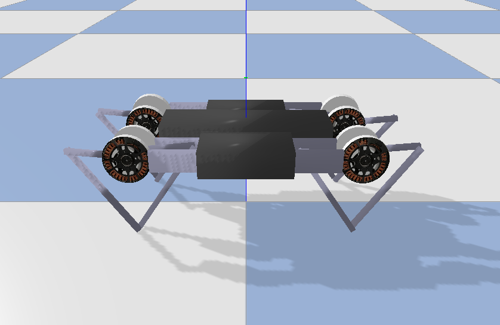
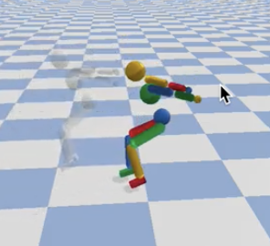

*******************************
Reinforcement Learning Gym Envs
*******************************

A suite of RL Gym Environments are installed during `pip install pybullet`.
This includes PyBullet versions of the OpenAI Gym environments such as ant,
hopper, humanoid and walker. There are also environments that apply in
simulation as well as on real robots, such as the Ghost Robotics Minitaur
quadruped, the MIT racecar and the KUKA robot arm grasping environments.

The source code of pybullet, pybullet_envs, pybullet_data and the examples are
here:
`https://github.com/bulletphysics/bullet3/tree/master/examples/pybullet/gym
<https://github.com/bulletphysics/bullet3/tree/master/examples/pybullet/gym>`_.

You can train the environments with RL training algorithms such as DQN, PPO,
TRPO and DDPG. Several  pre-trained examples are available, you can enjoy them
like this:

.. code-block:: bash

    pip install pybullet, tensorflow, gym
    python -m pybullet_envs.examples.enjoy_TF_HumanoidBulletEnv_v0_2017may
    python -m pybullet_envs.examples.kukaGymEnvTest

Environments and Data
=====================

After you `pip install pybullet`, the pybullet_envs and pybullet_data packages
are available. Importing the pybullet_envs package will register the
environments automatically to OpenAI Gym.

You can get a list of the Bullet environments in gym using the following
Python line:

.. code-block:: python

    print("\n".join(pybullet_envs.getList()))

We ported the `Roboschool environments <https://openai.com/blog/roboschool/>`_
to pybullet. The Roboschool environments are harder than the MuJoCo Gym
environments.

It is also possible to access the data, such as URDF/SDF robot assets,
Wavefront .OBJ files from the pybullet_data package. Here is an example how
to do this:

.. code-block:: python

    import pybullet
    import pybullet_data
    datapath = pybullet_data.getDataPath()
    pybullet.connect(pybullet.GUI)
    pybullet.setAdditionalSearchPath(datapath)
    pybullet.loadURDF("r2d2.urdf",[0,0,1])

Alternatively, manually append the datapath to the filename in the
:func:`~pybullet_api.loadURDF`/ :func:`~pybullet_api.loadSDF` commands.

Here is a list of available gym environments:

   MinitaurBulletEnv-v0

Simulation of the Ghost Robotics Minitaur quadruped on a flat ground.
This environment was used for the RSS 2018 "Sim-to-Real: Learning Agile
Locomotion For Quadruped Robots", see `paper on arxiv
<https://arxiv.org/abs/1804.10332>`_.

Reward based on distance traveled. Create the class using Gym:

.. code-block:: python

    env = gym.make('MinitaurBulletEnv-v0') 

or create the environment using the class directly, with parameters:

.. code-block:: python

    import pybullet_envs.bullet.minitaur_gym_env as e
    env = e.MinitaurBulletEnv(render=True)

   HumanoidDeepMimicBackflipBulletEnv-v1 and HumanoidDeepMimicWalkBulletEnv-v1

A re-implementation of the DeepMimic paper in PyBullet: a simulation of a
Humanoid mimic a reference motion. The implementation allows selecting the
reference motion. The backflip and walk reference motion are turned into a Gym
environment.

Pre-trained models of various motions are available as part of PyBullet:
requires Tensorflow 1.x (1.14):

.. code-block:: bash

    python3 -m pybullet_envs.deep_mimic.testrl --arg_file run_humanoid3d_backflip_args.txt

See `VIDEO <https://www.youtube.com/watch?v=aiWxIjtMMFI>`_. and an `example
<https://github.com/bulletphysics/bullet3/tree/master/examples/pybullet/gym/pybullet_envs/deep_mimic/mocap>`_
using the Human 3.6 dataset.

TODO

Stable Baselines & ARS, ES, ...
===============================

Train and Enjoy: DQN, PPO, ES
-----------------------------

Train using TensorFlow & PyTorch
--------------------------------

Evolution Strategies (ES)
-------------------------

Train using PyTorch PPO
-----------------------

