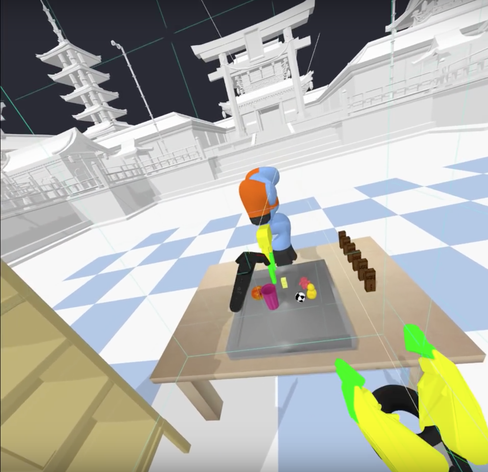

***************
Virtual Reality
***************

See also the `vrBullet quickstart guide
<https://docs.google.com/document/d/1I4m0Letbkw4je5uIBxuCfhBcllnwKojJAyYSTjHbrH8/edit#>`_.

The VR physics server uses the OpenVR API for HTC Vive and Oculus Rift Touch
controller support. OpenVR is currently working on Windows, Valve is also
working on a `Linux version
<https://github.com/ValveSoftware/openvr/issues/213>`_.

See also
`https://www.youtube.com/watch?v=VMJyZtHQL50 <https://www.youtube.com/watch?v=VMJyZtHQL50>`_
for an example video of the VR example, part of Bullet, that can be fully
controlled using PyBullet over shared memory, UDP or TCP connection.

For VR on Windows, it is recommended to compile the Bullet Physics SDK using
Microsoft Visual Studio (MSVC). Generate MSVC project files by running the
"build_visual_studio_vr_pybullet_double.bat" script. You can customize this
small script to point to the location of Python etc. Make sure to switch to
'Release' configuration of MSVC and build and run the
App_PhysicsServer_SharedMemory_VR*.exe. By default, this VR application will
present an empty world showing trackers/controllers (if available).
